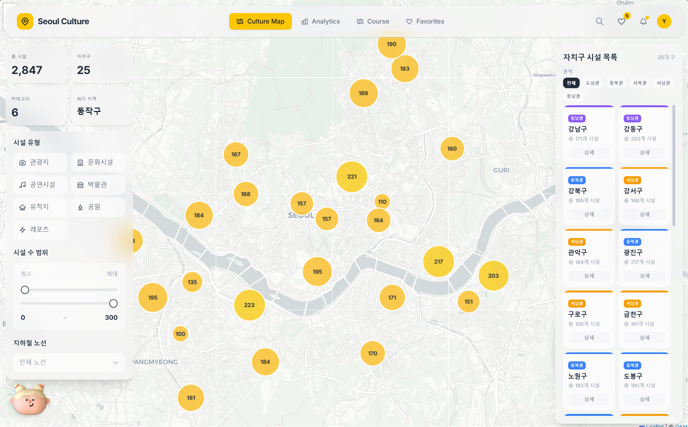
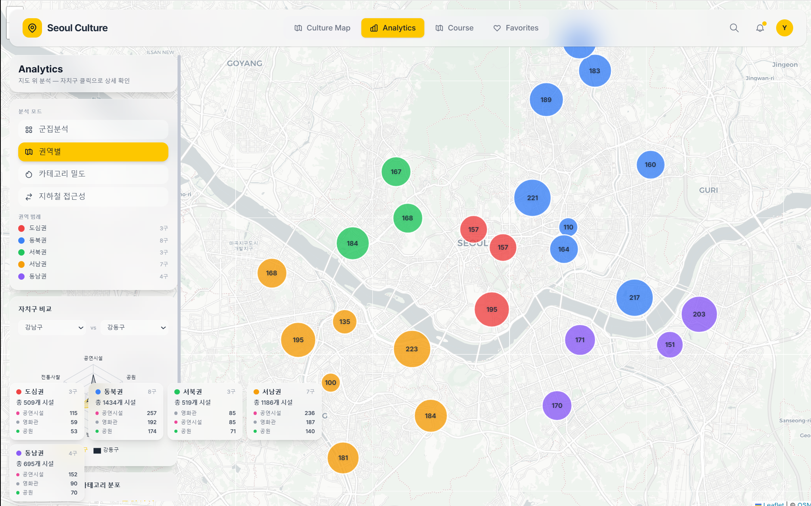
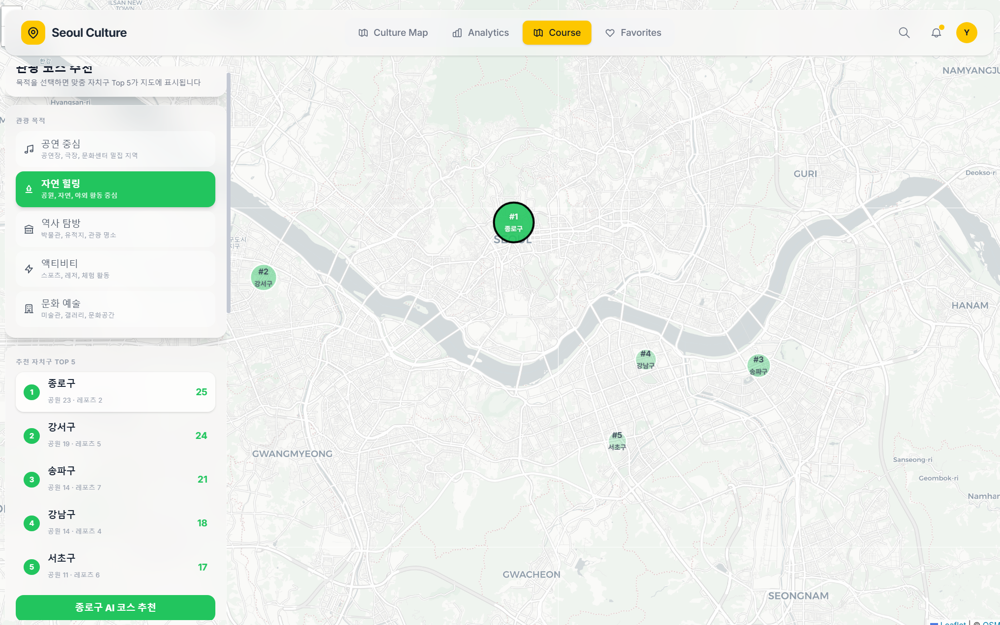
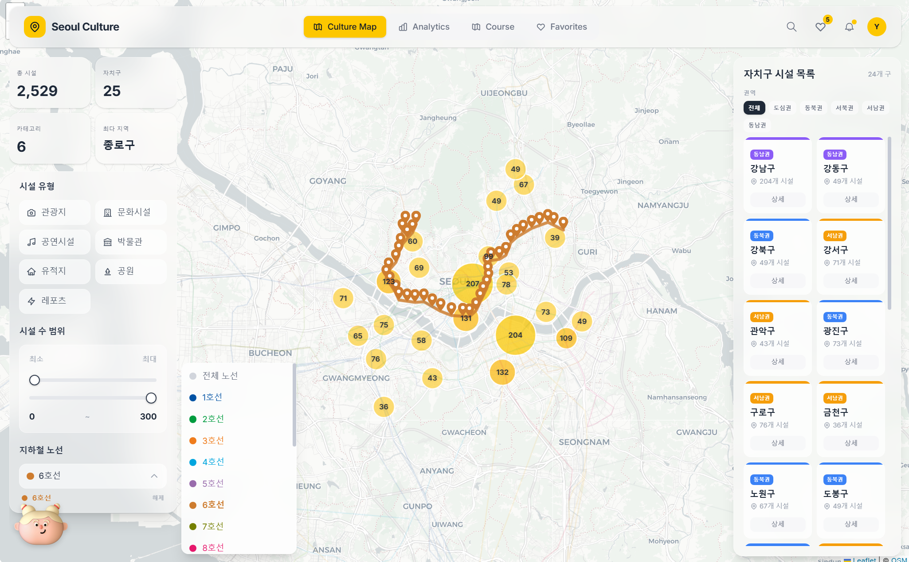
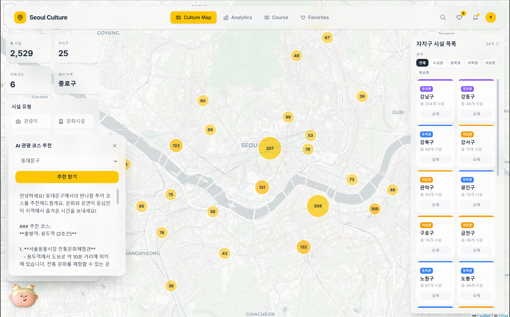
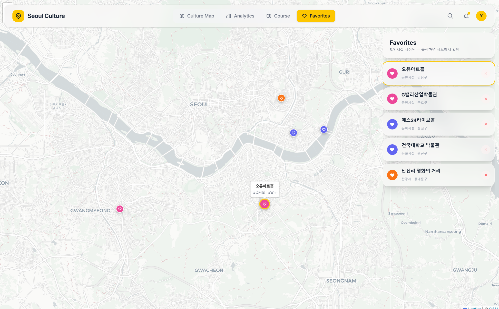

# Seoul Culture Map


> **학술제 팀 프로젝트(서울시 문화·여가시설 분석)를 개인 프로젝트로 확장한 인터랙티브 문화시설 탐색 맵 + AI 대화형 가이드**

<!-- 배포 완료 후 URL 교체 -->
<!-- **[Live Demo](https://seoul-culture-map.vercel.app)** -->

---

## 프로젝트 배경

### 원본 프로젝트 (학술제 — 팀 프로젝트)

통계 모임 학술제에서 **서울시 25개 자치구의 문화·여가시설 현황**을 분석했습니다.

- **주제**: 외국인에게 관광목적에 맞는 지역구 제안
- **기간**: 2023.09 — 2023.11
- **수상**: 2nd Place
- **데이터**: 서울시 공공데이터 (6개 카테고리)
- **핵심 분석**:
  - 영화관, 공연시설, 박물관/유적지, 방탈출, 공원, 전통사찰 6개 카테고리
  - 25개 자치구별 시설 분포 현황 분석
  - 군집분석을 통한 관광 목적별 지역구 분류
  - R (dplyr, ggplot2) 기반 통계 분석

### 확장 (개인 프로젝트)

팀 프로젝트의 분석 결과를 **인터랙티브 웹 서비스**로 전환했습니다.
- **기간**: 2026.03 ~

학술제 데이터는 2023년 기준으로 약 2~3년이 지나 노후화된 상태였기 때문에, **서울 열린데이터광장**과 **한국관광공사 Tour API**를 연동하여 최신 시설 데이터를 수집했습니다. 이 과정에서 카테고리 체계도 변경되었습니다 — 기존 학술제의 6개 카테고리(영화관, 방탈출, 전통사찰 등)에서 API 기반의 7개 카테고리(관광지, 문화시설, 공연시설, 박물관/유적지, 유적지, 공원, 레포츠)로 재편되었습니다.

| 구분 | 학술제 (팀) | Seoul Culture Map (개인) |
|------|-----------|--------------------------|
| 형태 | R 분석 스크립트 + 보고서 | 풀스택 웹 서비스 |
| 데이터 | CSV 정적 데이터 (2023년) | 공공 API + DB 실시간 서빙 |
| 카테고리 | 영화관, 공연시설, 박물관/유적지, 방탈출, 공원, 전통사찰 | 관광지, 문화시설, 공연시설, 박물관/유적지, 유적지, 공원, 레포츠 |
| 시각화 | ggplot2 정적 차트 | Leaflet 인터랙티브 맵 |
| 분석 | R 스크립트 | 지도 위 실시간 분석 시각화 |
| AI | 없음 | LangGraph 멀티스텝 에이전트 + RAG |
| 결과 | PDF 보고서 | React 대시보드 (4개 페이지) + AI 챗봇 |
| 배포 | 로컬 실행 | Render + Vercel 클라우드 |

---

## 스크린샷


> 서울시 25개 자치구의 2,500+ 문화시설을 카테고리별 색상 마커로 표시


> K-means 군집분석, 권역별 분류, 카테고리 밀도 히트맵 등 4가지 분석 모드


> 관광 목적별 맞춤 자치구 Top 5 + AI 기반 반나절 투어 코스 생성

<details>
<summary>더 많은 스크린샷 보기</summary>

### 시설 탐색

> 카테고리 필터, 시설 클릭 팝업, 자치구 전환 등 인터랙티브 탐색 과정.

### 지하철 노선 필터

> 19개 지하철 노선 필터링 + 역 핀 표시.


> 노선 선택/해제에 따라 역 마커가 실시간으로 토글.

### 분석 모드 전환

> 군집분석 → 권역별 → 카테고리 밀도 → 지하철 접근성 전환 과정.

### AI 코스 추천

> 관광 목적 선택 → 자치구 랭킹 → AI 코스 추천 생성 전체 흐름.

### AI 마스코트

> 플로팅 AI 마스코트 위젯. 자연어 대화로 맞춤 관광 추천 + 지도 연동.

### 즐겨찾기

> 하트 버튼으로 저장한 시설이 지도 위 하트 마커로 표시.

</details>

---

## 핵심 기능

### 1. Culture Map — 인터랙티브 시설 탐색

- Leaflet 기반 서울시 25개 자치구 지도
- **7개 카테고리** 시설 마커 (관광지/문화시설/공연시설/박물관·유적지/유적지/공원/레포츠)
- 카테고리별 색상 원형 아이콘 (관광지: 주황, 문화시설: 인디고, 공연시설: 핑크, 박물관/유적지: 보라, 유적지: 퍼플, 공원: 초록, 레포츠: 노랑)
- 시설 클릭 시 **사진 + 상세 정보 팝업** (한국관광공사 이미지)
- 시설별 **즐겨찾기** (하트 버튼, localStorage 저장)
- 밀집도 히트맵 / K-means 군집분석 토글
- 지하철 19개 노선 필터 + 역 핀 표시
- 자치구 경계선 GeoJSON 오버레이
- 자치구 목록 패널 (5대 권역별 필터: 도심/동북/서북/서남/동남)

### 2. AI 대화형 가이드 (NEW)

LangGraph 멀티스텝 에이전트 파이프라인 기반의 대화형 AI 관광 가이드:

- **자연어 대화** — "종로구 추천해줘", "박물관 어디있어?", "서울 공원 추천" 등 자유 텍스트 입력
- **3단계 에이전트 파이프라인**:
  1. **의도 분류** — GPT-4o-mini structured output로 recommend/search/info/chitchat 분류
  2. **데이터 검색** — SQLite DB 조회 + ChromaDB 시맨틱 벡터 검색 (RAG)
  3. **응답 생성** — 검색된 컨텍스트 기반 맞춤 응답 생성
- **ChromaDB 시맨틱 검색** — 2,500+ 시설을 로컬 임베딩 (all-MiniLM-L6-v2), API 비용 없음
- **SSE 스트리밍** — 토큰 단위 실시간 응답 표시
- **지도 연동** — "지도에 표시" 버튼 클릭 시 추천 장소를 번호 마커 + 경로선으로 지도에 표시
- **대화 이력** — SQLite에 세션/메시지 영구 저장, 이전 대화 불러오기 지원

```
사용자 메시지
    ↓
[의도 분류] → chitchat → [응답 생성] → 스트리밍 출력
    ↓
[DB + 벡터 검색] → [응답 생성] → 스트리밍 출력 + 지도 마커
```

### 3. Analytics — 지도 위 데이터 분석

4가지 분석 모드를 지도 위에 직접 시각화:

- **군집분석** — K-means 클러스터별 색상 마커 + 범례
- **권역별** — 서울 5대 권역 색상 분류 + 권역별 시설 요약 카드
- **카테고리 밀도** — 선택 카테고리의 시설 수에 따라 마커 색상/크기 변화 (히트맵)
- **지하철 접근성** — 자치구별 반경 1.5km 내 지하철역 수 시각화 + Top 10 랭킹

사이드바: 자치구 비교 레이더 차트 + 전체 카테고리 분포 파이 차트

### 4. Course — 관광 목적별 코스 추천

5가지 관광 목적 선택 → 맞춤 자치구 Top 5 지도 표시:

- **공연 중심** — 공연시설 + 문화시설 밀집 지역
- **자연 힐링** — 공원 + 레포츠 중심
- **역사 탐방** — 박물관/유적지 + 관광지
- **액티비티** — 레포츠 + 공원
- **문화 예술** — 문화시설 + 공연시설 + 관광지

자치구 선택 후 **AI 코스 추천** (OpenAI 연동, fallback 지원)

### 5. Favorites — 즐겨찾기 관리

- Culture Map에서 저장한 시설이 **지도 위 하트 마커**로 표시
- 클릭 시 해당 위치로 지도 이동 (flyTo)
- 시설 객체(이름, 좌표, 카테고리, 자치구) localStorage 영구 저장

---

## 데이터 소스

| 소스 | 데이터 | 건수 |
|------|--------|------|
| **서울 열린데이터광장** | 문화공간 (공연장, 미술관, 도서관 등) | ~1,039 |
| **서울 열린데이터광장** | 공원 정보 | ~133 |
| **서울 열린데이터광장** | 지하철역 마스터 | ~700+ |
| **한국관광공사 Tour API** | 관광지, 문화시설, 공연, 레포츠 (+이미지) | ~1,200 |
| **학술제 CSV** | 자치구별 시설 집계 (seed data) | 25구 |

총 **2,500+ 개별 시설**, 이 중 **1,177개 시설에 사진** 포함

---

## 기술 스택

### Backend

| 기술 | 용도 |
|------|------|
| **FastAPI** | REST API 서버 + SSE 스트리밍 |
| **SQLAlchemy** | ORM |
| **SQLite** | 관계형 데이터베이스 |
| **LangGraph** | 멀티스텝 AI 에이전트 파이프라인 |
| **LangChain + OpenAI** | LLM 연동 (GPT-4o-mini) |
| **ChromaDB** | 벡터 DB — 시맨틱 검색 (로컬 임베딩) |
| **scikit-learn** | K-means 군집분석 |
| **httpx** | 외부 API 비동기 호출 |
| **sse-starlette** | Server-Sent Events 스트리밍 |

### Frontend

| 기술 | 용도 |
|------|------|
| **React 19** | UI 프레임워크 |
| **Vite** | 빌드 도구 |
| **Tailwind CSS v4** | 스타일링 (글래스모피즘 UI) |
| **Leaflet / React-Leaflet** | 인터랙티브 지도 |
| **Recharts** | 차트 (레이더, 파이, 바) |
| **Axios** | API 통신 |

### Infra

| 기술 | 용도 |
|------|------|
| **Render** | 백엔드 배포 |
| **Vercel** | 프론트엔드 배포 |

---

## 아키텍처

### 시스템 아키텍처

```
┌─────────────┐      ┌──────────────────────┐      ┌─────────────────┐
│   Frontend  │      │      Backend         │      │  External APIs  │
│  React 19   │◄────►│   FastAPI            │◄────►│                 │
│  Vite       │ REST │                      │      │  서울 열린데이터  │
│  Leaflet    │ /api │  ┌─── LangGraph ───┐ │      │  한국관광공사     │
│  Tailwind   │  +   │  │ Intent → Data  │ │      │  OpenAI          │
│             │ SSE  │  │ Retrieval →    │ │      └─────────────────┘
│             │      │  │ Response Gen.  │ │
│             │      │  └────────────────┘ │
└─────────────┘      └──────┬─────┬────────┘
                            │     │
                     ┌──────▼──┐ ┌▼──────────┐
                     │ SQLite  │ │ ChromaDB   │
                     │ 2,500+  │ │ 벡터 검색   │
                     │ 시설    │ │ (임베딩)    │
                     └─────────┘ └────────────┘
```

### LangGraph 에이전트 파이프라인

사용자의 자연어 메시지를 3단계로 처리하는 멀티스텝 에이전트:

```
                        ┌─────────────────┐
                        │   사용자 메시지   │
                        └────────┬────────┘
                                 │
                    ┌────────────▼────────────┐
                    │   1. 의도 분류 (Intent)  │
                    │   GPT-4o-mini           │
                    │   Structured Output     │
                    └────────────┬────────────┘
                                 │
                 ┌───────────────┼───────────────┐
                 │               │               │
          ┌──────▼──────┐ ┌─────▼──────┐ ┌──────▼──────┐
          │  recommend  │ │   search   │ │  chitchat   │
          │  (코스 추천) │ │ (장소 검색) │ │  (일상 대화) │
          └──────┬──────┘ └─────┬──────┘ └──────┬──────┘
                 │               │               │
    ┌────────────▼────────────┐ │               │
    │  2. 데이터 검색          │ │               │
    │                         │ │               │
    │  ┌─────────┐ ┌────────┐│ │               │
    │  │ SQLite  │ │ChromaDB││ │               │
    │  │ DB 조회 │ │시맨틱  ││◄┘               │
    │  │         │ │검색    ││                  │
    │  └────┬────┘ └───┬────┘│                  │
    │       └─────┬────┘     │                  │
    └─────────────┬──────────┘                  │
                  │                             │
    ┌─────────────▼─────────────────────────────▼─┐
    │         3. 응답 생성 (Response Gen.)         │
    │         GPT-4o-mini + 컨텍스트 주입          │
    │                                              │
    │  [일반 모드] JSON 응답                       │
    │  [스트리밍 모드] SSE 토큰 단위 전송           │
    └──────────────────┬───────────────────────────┘
                       │
          ┌────────────▼────────────┐
          │  응답 텍스트 (마크다운)   │
          │  + 추천 장소 좌표 목록   │──► 지도 마커 표시
          │  + 채팅 이력 DB 저장     │
          └─────────────────────────┘
```

**노드별 상세:**

| 노드 | 역할 | LLM 호출 | 비용 |
|------|------|---------|------|
| **의도 분류** | 사용자 메시지 → recommend/search/info/chitchat 분류 + 자치구/카테고리 추출 | GPT-4o-mini (Structured Output) | ~$0.001 |
| **데이터 검색** | SQLite 쿼리 (시설, 지하철, 군집) + ChromaDB 시맨틱 검색 | 없음 (순수 DB 조회) | $0 |
| **응답 생성** | 검색된 컨텍스트를 기반으로 맞춤 응답 생성 | GPT-4o-mini (스트리밍) | ~$0.002 |

**요청당 총 비용: ~$0.003** (GPT-4o-mini 2회 호출)

### 데이터 파이프라인

```
┌──────────────────────── 데이터 수집 (POST /api/sync) ────────────────────────┐
│                                                                              │
│  ┌────────────────────┐    ┌────────────────────┐    ┌──────────────────┐   │
│  │ 서울 열린데이터광장  │    │ 한국관광공사 Tour API│    │ 학술제 CSV (seed) │   │
│  │                    │    │                    │    │                  │   │
│  │ • 문화공간 ~1,039  │    │ • 관광지           │    │ • 자치구별 집계   │   │
│  │ • 공원 ~133        │    │ • 문화시설         │    │   (6카테고리 ×    │   │
│  │ • 지하철역 ~700+   │    │ • 공연/축제        │    │    25자치구)      │   │
│  │                    │    │ • 레포츠           │    │                  │   │
│  │                    │    │ • + 이미지 URL     │    │                  │   │
│  └────────┬───────────┘    └────────┬───────────┘    └────────┬─────────┘   │
│           │                         │                         │             │
│           └────────────┬────────────┘                         │             │
│                        ▼                                      │             │
│           ┌────────────────────────┐                          │             │
│           │  데이터 정규화          │                          │             │
│           │  • 좌표 검증/표준화     │                          │             │
│           │  • 자치구 추출          │                          │             │
│           │  • 카테고리 매핑        │                          │             │
│           │  • 중복 제거            │                          │             │
│           └────────────┬───────────┘                          │             │
│                        ▼                                      ▼             │
│           ┌────────────────────────────────────────────────────┐             │
│           │                    SQLite DB                       │             │
│           │                                                    │             │
│           │  places (2,500+)  │ facilities (집계) │ subway_stations │
│           │  chat_sessions    │ chat_messages     │                 │
│           └────────────────────────┬───────────────────────────┘             │
│                                    │                                        │
│                                    ▼                                        │
│                       ┌────────────────────────┐                            │
│                       │  ChromaDB 임베딩        │                            │
│                       │  all-MiniLM-L6-v2      │                            │
│                       │  (로컬, API 비용 없음)  │                            │
│                       │                        │                            │
│                       │  "{시설명} — {카테고리}, │                            │
│                       │   {자치구}. 주소: ..."  │                            │
│                       └────────────────────────┘                            │
└──────────────────────────────────────────────────────────────────────────────┘

서버 시작 시:
  1. SQLite 테이블 생성 + seed 데이터 로드
  2. ChromaDB 초기화 + places 임베딩 (첫 실행 ~30초, 이후 캐시)

수동 동기화 시:
  POST /api/sync → 서울 API + Tour API → SQLite 갱신 → 재임베딩
```

---

## 빠른 시작

### 환경변수 설정

```bash
cd backend
cp .env.example .env
# .env 파일을 열어 실제 API 키로 교체
```

| 변수 | 필수 | 설명 |
|------|------|------|
| `SEOUL_DATA_API_KEY` | O | 서울 열린데이터광장 API 키 |
| `TOUR_API_KEY` | O | 한국관광공사 Tour API 키 |
| `OPENAI_API_KEY` | 선택 | AI 대화형 가이드 + 코스 추천용 (없으면 fallback) |

### Backend

```bash
cd backend
python -m venv venv
venv/Scripts/activate   # Windows
pip install -r requirements.txt
uvicorn app.main:app --reload --port 8003
```

> 첫 실행 시 ChromaDB 임베딩 모델 다운로드로 30~60초 소요됩니다. 이후 실행은 캐시되어 빠릅니다.

### Frontend

```bash
cd frontend
npm install
npm run dev   # → http://localhost:5173
```

### 데이터 동기화 (최신 공공데이터 반영)

```bash
curl -X POST http://localhost:8003/api/sync
```

---

<details>
<summary>API 엔드포인트</summary>

FastAPI 자동 문서: `http://localhost:8003/docs`

| Method | Path | 설명 |
|--------|------|------|
| GET | `/api/facilities/stats` | 전체 통계 (카테고리별 시설 수) |
| GET | `/api/facilities/districts` | 자치구별 시설 분포 |
| GET | `/api/facilities/districts/{name}` | 자치구 상세 |
| GET | `/api/facilities/search?q=` | 시설 검색 |
| GET | `/api/places?district=&category=&limit=` | 개별 시설 목록 (이미지 포함) |
| GET | `/api/places/{id}` | 시설 상세 |
| GET | `/api/subway` | 전체 지하철역 |
| GET | `/api/subway/nearest?lat=&lng=` | 최근접 역 |
| GET | `/api/clusters` | K-means 군집분석 결과 |
| GET | `/api/recommend?district=&lang=` | AI 코스 추천 (레거시) |
| **POST** | **`/api/chat`** | **AI 대화형 가이드 (JSON 응답)** |
| **POST** | **`/api/chat/stream`** | **AI 대화형 가이드 (SSE 스트리밍)** |
| GET | `/api/chat/sessions` | 채팅 세션 목록 |
| GET | `/api/chat/history/{session_id}` | 채팅 이력 조회 |
| DELETE | `/api/chat/sessions/{session_id}` | 채팅 세션 삭제 |
| POST | `/api/sync` | 공공데이터 API 수동 동기화 |

</details>

<details>
<summary>프로젝트 구조</summary>

```
seoul-culture-map/
├── README.md
├── DEVLOG.md
├── start.bat                 # 백엔드+프론트 동시 실행 (Windows)
├── .gitignore
│
├── backend/
│   ├── requirements.txt
│   ├── .env.example          # 환경변수 템플릿
│   ├── .env                  # API 키 (git 제외)
│   ├── run_server.py         # uvicorn 실행 스크립트
│   ├── data/
│   │   └── culture.db        # SQLite 시드 데이터
│   ├── tests/
│   │   ├── conftest.py       # pytest 픽스처
│   │   ├── test_api.py       # API 엔드포인트 테스트
│   │   └── test_utils.py     # 유틸리티 함수 테스트
│   └── app/
│       ├── main.py           # FastAPI 앱 + lifespan (ChromaDB 초기화 포함)
│       ├── config.py         # 환경변수 설정
│       ├── database.py       # SQLAlchemy 엔진
│       ├── utils.py          # 공통 유틸리티
│       ├── agent/            # LangGraph AI 에이전트 (NEW)
│       │   ├── state.py      # AgentState TypedDict
│       │   ├── schemas.py    # IntentClassification, AgentResponse
│       │   ├── nodes.py      # 3개 노드: 의도분류, 데이터검색, 응답생성
│       │   └── graph.py      # StateGraph 조립 + run_agent / run_agent_stream
│       ├── models/
│       │   ├── facility.py   # 자치구별 집계 모델
│       │   ├── place.py      # 개별 시설 모델 (좌표, 이미지)
│       │   ├── subway.py     # 지하철역 모델
│       │   └── chat.py       # ChatSession, ChatMessage 모델 (NEW)
│       ├── schemas/
│       │   └── facility.py   # Pydantic 응답 스키마
│       ├── services/
│       │   ├── data_loader.py    # CSV seed
│       │   ├── clustering.py     # K-means
│       │   ├── seoul_api.py      # 서울 공공데이터 API
│       │   ├── tour_api.py       # 한국관광공사 API
│       │   ├── retriever.py      # 데이터 조회 서비스 (NEW)
│       │   └── vectorstore.py    # ChromaDB 벡터 검색 (NEW)
│       └── routers/
│           ├── facility.py   # 시설/통계/지하철 라우터
│           ├── recommend.py  # AI 추천 라우터 (레거시)
│           └── chat.py       # AI 대화형 가이드 라우터 (NEW)
│
├── frontend/
│   ├── package.json
│   ├── vite.config.js        # 포트 5173, 프록시 → :8003
│   └── src/
│       ├── App.jsx           # 라우터 (/, /analytics, /course, /favorites)
│       ├── main.jsx
│       ├── constants.js      # 좌표, 카테고리 색상 상수
│       ├── utils.js          # 공통 유틸리티
│       ├── api/
│       │   ├── client.js     # API 함수 + mock fallback
│       │   └── chat.js       # AI 챗봇 API (스트리밍 포함) (NEW)
│       ├── hooks/
│       │   └── useFavorites.js   # 즐겨찾기 (localStorage v2)
│       ├── components/
│       │   ├── SeoulMap.jsx      # 메인 지도 (마커, 히트맵, 팝업, AI 하이라이트)
│       │   ├── ChatPanel.jsx     # AI 대화형 챗봇 패널 (NEW)
│       │   ├── CategoryFilter.jsx
│       │   ├── SubwayFilter.jsx
│       │   ├── DistrictList.jsx  # 5대 권역 필터
│       │   ├── DistrictPopup.jsx
│       │   ├── StatCards.jsx
│       │   ├── Navbar.jsx
│       │   ├── RangeSlider.jsx
│       │   ├── FavoritesPanel.jsx
│       │   ├── TourismTags.jsx   # 관광 태그 컴포넌트
│       │   └── AiMascot.jsx      # AI 마스코트 (ChatPanel 연동)
│       └── pages/
│           ├── Dashboard.jsx     # Culture Map 페이지 (AI 지도 연동)
│           ├── AnalyticsPage.jsx # 4모드 분석 (지도 위)
│           ├── CoursePage.jsx    # 목적별 코스 추천
│           └── FavoritesPage.jsx # 즐겨찾기 (지도 + 패널)
│
├── data/                     # 원본 CSV 데이터
├── image/                    # 스크린샷 및 에셋
└── logs/
    └── README_TODO.md        # 개발 TODO 목록
```

</details>

---

## 회고

### 어려웠던 점

- **공공 API 데이터 정규화** — 두 API의 응답 형식·좌표 필드명이 달라 하나의 테이블로 통합하는 데 많은 변환 작업 필요
- **Leaflet + React 동기화** — Leaflet의 DOM 직접 조작과 React Virtual DOM의 라이프사이클 불일치로 마커·팝업 렌더링 이슈 반복
- **CSS overflow 충돌** — `overflow-y: auto`가 `overflow-x`도 강제해 드롭다운이 잘리는 문제, `position: fixed`로 우회
- **프론트-백엔드 필드명 불일치** — `lat`/`lng` vs `latitude`/`longitude` 차이로 전체 마커 미표시 버그 발생
- **LangGraph 에이전트 설계** — 노드 간 상태 전달, DB 세션 주입, 스트리밍과 비스트리밍 모드 분리 등 아키텍처 결정

### 배운 점

- **데이터 분석의 가치는 전달 방식에 따라 달라진다** — R 정적 보고서를 인터랙티브 웹으로 전환하며 체감
- **API-first 설계의 중요성** — 응답 스키마를 먼저 정의하고 프론트를 개발하는 흐름이 효율적
- **지도 시각화 핵심은 정보 밀도 조절** — 2,500+ 마커를 클러스터링·히트맵으로 조절하는 UX 패턴 습득
- **외부 API 의존성엔 fallback 필수** — mock 데이터, 에러 바운더리 등 방어적 프로그래밍 실전 적용
- **연산 위치 판단** — 군집분석은 서버(scikit-learn), 거리 계산은 프론트(Haversine)로 분리하는 기준 체득
- **RAG 파이프라인 실전 적용** — LangGraph 에이전트 + ChromaDB 벡터 검색으로 자연어 질의 → 맞춤 추천 흐름 구현

### 향후 방향

TypeScript 마이그레이션, 다국어(i18n) 지원, Docker 배포 환경 구성 등을 검토 중입니다.

---

## 라이선스

MIT License

---

## 개발자

**윤경은 (Yoon Gyeongeun)**
- 학술제 팀 프로젝트 참여 → 개인 프로젝트로 확장
- GitHub: [@ykgstar37-lab](https://github.com/ykgstar37-lab)
